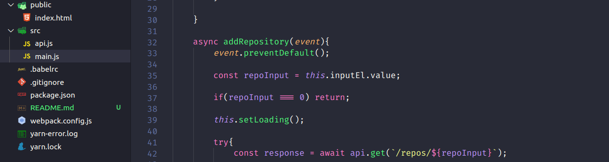
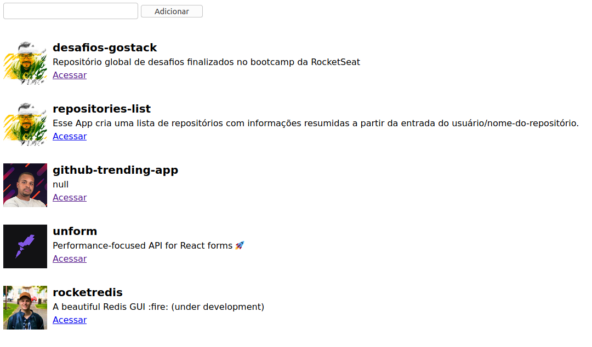

## 🚀 LISTA DE REPOSITÓRIOS 🚀 

## SOBRE ##

 O repositório consiste em uma aplicação de estudos onde é possível informar o usuário e o nome de qualquer repositório no gitHub e recuperar uma lista com informações específicas (Nome do Reposiótiro, Descrição, Avatar e link do repositório ).

Para concretizar o projeto foram usados os seguintes recursos/ferramentas/tecnologias:

- Api do gitHub
- Biblioteca do Axios para recuperar a API
- WebPack
- NodeJS
- CSS
- HTML
- Nodemon

